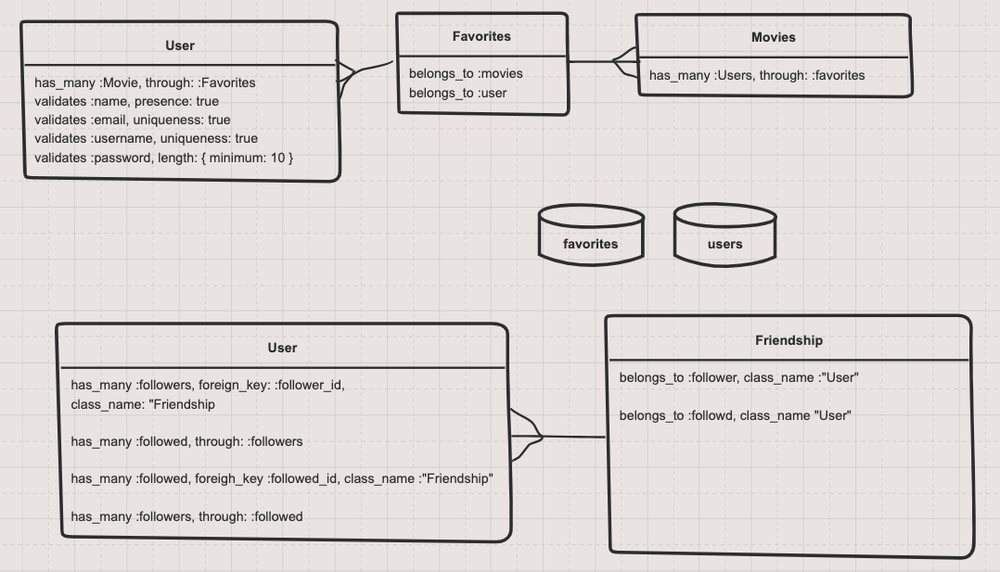

# Wilson

Wilson is a web app that allows to users to match on a movie. 

### API

Using TMDB https://www.themoviedb.org/

for endpoints and docs refer here:

https://developers.themoviedb.org/3/search/search-companies

### Mod5 Requirements

Back-end requirements (Rails):

[ ] Auth

[ ] Multiple has_many_through relationships

[ ] Custom routes 
<!-- custom route for Auth authorize ation -->
[ ] Custom controller/model methods
<!--  -->
[ ] Validations
<!-- add validations to auth -->

 Front-end requirements (React):

[ ] Auth

[ ] external api

[ ] Custom CSS

### Front End Sketch 

https://sketchboard.me/hCqMPzARKFxI#/menushare

#### Components:
App (Will handle state)
Sidebar
Content Container
Header
Footer

### Backend Models

### Logo

### User Stories

[ ] the user will not be able to see their liked movies

[ ] users will be able to create an account
<!-- name, username, email, password -->

[ ] users will be able to view all movies

[ ] users will be able to add movies to favorites via a :heart:
<!-- Via a heart icon  -->

[ ] users will be able to connect with a friend
<!-- will search database for that users credentials -->

[ ] user can remove a friend

[ ] users will be able to click a button to show a randomized movie from the two friends movies selection 
<!-- compare the two databases and find all that match -->

### MVP 

[ ] Complete the user stories. 

### Stretch 

 [ ] users will be able to filter connected movies by genre

 [ ] add popcorn suggestions for movie genre